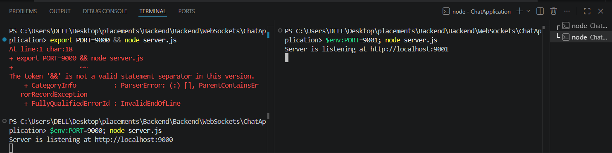
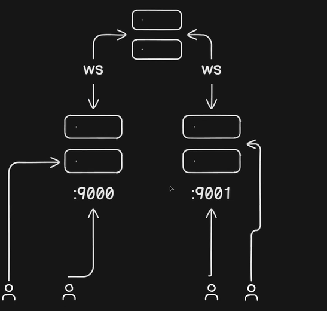
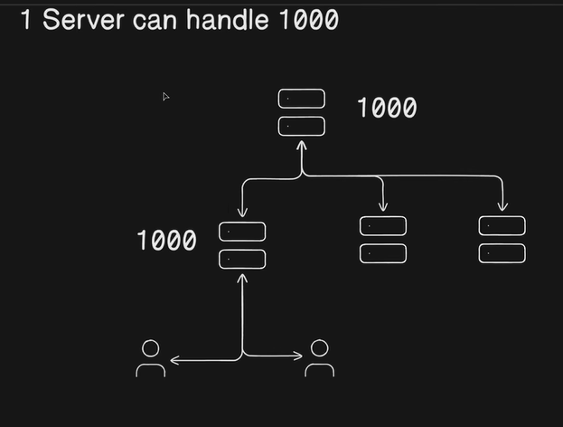

What we are going to build?
We are going to build a chat application, where a user sends a message and it is broadcasted to everyone by the server.
[BasicArchitecture](Img/Build.png)

Halfway establised App:
[ChatApplication](Img/Websocket.png)

Now, add this in index.html to make chats applicable on the UI.
 //Connection to send ping message:
        connection.onopen = () => {
          connection.onmessage = (message) =>{
            console.log("Message Recieved...", message);
            const rawData = message.data;
            const parsedData = JSON.parse(rawData);
            const text = parsedData.message;

            const li = document.createElement('li');
            li.innerText = text;
            messagesContainer.appendChild(li);
          };
          ...other unecessary code.}
[ChatUI](Img/ChatUI.png)

From this phase, we can build application such as:
1. Stock exchange.
2. Notification system.
3. Fully managed chat Application.

Issues of scalability:
1. What are webSocket connections internally> these webSocket are stateful connections.
Normally, http is stateless connection. we send the request, server process the request and send the response. After that connection is closed.
But, webSockets follows:
webSocket consumes some resources in the form of memory(fileDescriptor) to maintain the connection.
This is the actual bottleneck that causes issue when we want to scale the system.
More precisely, there is a limit on how many connections a server can handle?

The issue with horizontal scaling:
This is the actual bottleneck that causes issue when we want to scale the system.
More precisely, there is a limit on how many connections a server can handle?

Reason: We can think of an approach where we can vertically scale the server as 2GB>4GB>8GB>16GB as the user doubles.But to do so, we need to stop the server and add some memory and again restart the server. This means that we cannot scale the running server. Note: we cannot stop the running server if we have to fully utilize the webSocket connections.

The issue with vertical scaling:
The idea is to add more servers to the system. Once the main server reach its 80% capacity, I will add one more server.

But, this approach has one catch:
Client A is connected to server 9000.
Client B is connected to server 9000.
Client C is connected to server 9001.

whenever the client A or B send the message to the server, only connected client(A and B) would recieve back the connection, client C would not recieve the broadCast message.
Same goes with server 9001.
This isolation of the server is main bottleneck in the horizontal scaling.
TO tackle this we use a Relay server. This can be manually-created-server or this can be a REDIS server.
SO, we can say that REDIS is a broker server for the server 9000 and 9001.

Implementation:
S1: Create a docker-compose.yml file to create a REDIS file.
S2: Make connection.js file to establish connection with Redis.
Redis do not work on the single channel, it publish and subscribe on two different channels. 
See the code in connection.js

S3: configure server.js files:
S3(A): import both redisPublish and redisSubscribe.

S3(B): establish a publish channel as:
websocket.on('message', async (data)=>{     
        console.log('Websocket Message Recieved', data.toString());
        await redisPublish.publish(REDIS_CHANNEL, data.toString); // whenever we have to publish, 
        // we publish it over a channel. Our channel name is : ws-messages.
    });

S3(C): Establish a subscribe channel:
redisSubscribe.subscribe(REDIS_CHANNEL);

S4(D):Broadcasting to all the clients on the different server that is 9000 and 9001.
redisSubscribe.on('message', (channel, message) => {
    if (channel === REDIS_CHANNEL) {
        // Broadcast message to all of your connected clients
        wsServer.clients.forEach((client) => {
            client.send(message.toString());
        });
    }
});

Explanation: How this helps in scaling the system?

Logic:
If one server can handle 1000 connections. This means a relay server can handle 1000 servers(which is the user of it).
In turns theses servers can handle 1000 users.
So, in total we are able to handle 1000*1000 = 10,00,000 users efficiently.

