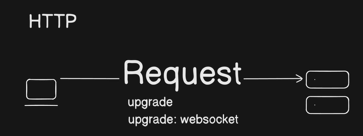

# Websockets:
This is a client-side browser-built-in feature. Type "websocket" in console(Inspect) and see that it is a window object.

1. Fundamentals of WebSockets:

    HTTP Limitations: Standard HTTP follows a request-response cycle that closes the connection after each task, making real-time communication difficult.
    
    WebSockets: They provide a fully-duplex, persistent connection that remains open, allowing both the server and client to exchange data at any time without repetitive polling.
    
    Connection Process: The process starts via a standard HTTP handshake where the client requests the server to upgrade the connection to the WebSocket protocol.

2. Scaling Challenges:

    Vertical Scaling: Simply adding more CPU or RAM to a server is limited and causes downtime, making it an unsustainable long-term strategy.
    Horizontal Scaling & The Problem: While adding more servers (horizontal scaling) is better, it creates a communication gap. Because WebSockets are stateful (the server must remember the connection), a client connected to Server A cannot communicate with a client connected to Server B.

3. The Solution: Redis as a Broker:

    To enable communication across multiple server instances, there is need to introduce Redis as a message broker using the Pub/Sub (Publish/Subscribe) model.
    When a message is sent, the server publishes it to Redis rather than broadcasting locally. All other servers subscribe to this channel, receive the message from Redis, and then broadcast it to their respective connected clients.
